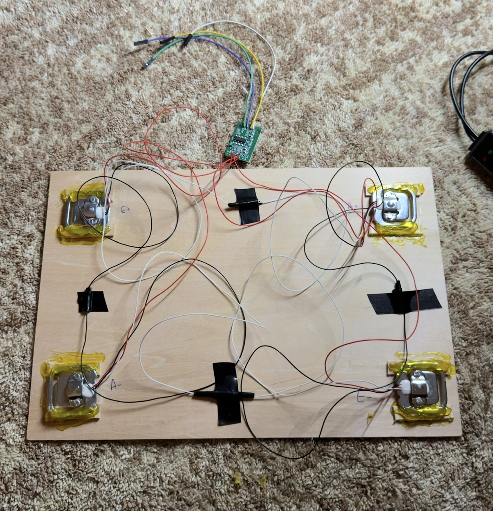

# Sustainable Food Waste Scale ♻️⚖️

An embedded system designed to **measure and quantify food waste using weight**. The project uses a digital scale to compare the amount of food before and after consumption, providing a simple way to track how much food is being wasted. (Work In Progress)

## Prototype

  

  <em>Physical prototype showing the four-load-cell configuration and HX711 interface.</em>

## How It Works

1. A plate, bowl, or other container is placed on the scale.
2. The system uses **tare** to remove the container's weight.
3. The food is weighed before consumption.
4. The remaining food is weighed afterward.
5. The system calculates:

**Food Waste = Initial Food Weight − Remaining Food Weight**

This provides a measurable value for the amount of food consumed and wasted. 

## Hardware

- Raspberry Pi
- 4 × Load Cells
- HX711 Load Cell Amplifier / ADC
- Display
- Camera
- Scale platform/frame

The four load cells are positioned around the platform to provide stable weight measurements.

## Purpose 🌱

Food waste is an important sustainability problem, but it can be difficult to understand without measurable data. This project demonstrates a low-cost embedded approach for **quantifying food waste at the point of consumption**. I am trying to test this out in my local university's cafeteria as I have noticed a lot of the food is not being consumed. I would to spread some awareness by making students more alert with this issue.

Instead of relying on estimates, the system directly measures changes in food weight.

## Core Features

- ⚖️ Digital weight measurement
- 🥣 Container tare functionality
- 🍽️ Before-and-after food measurement
- 📟 Display of measured weight/Using QR code to identify the plate uniquely
- 🌱 Sustainability-focused application

## Project Goal

The goal of this prototype is to combine **embedded systems and sustainability** to create a practical method for measuring food waste and encouraging more informed food-consumption habits. I have yet to finalize all functionalities with the hardware and software so more to come!
